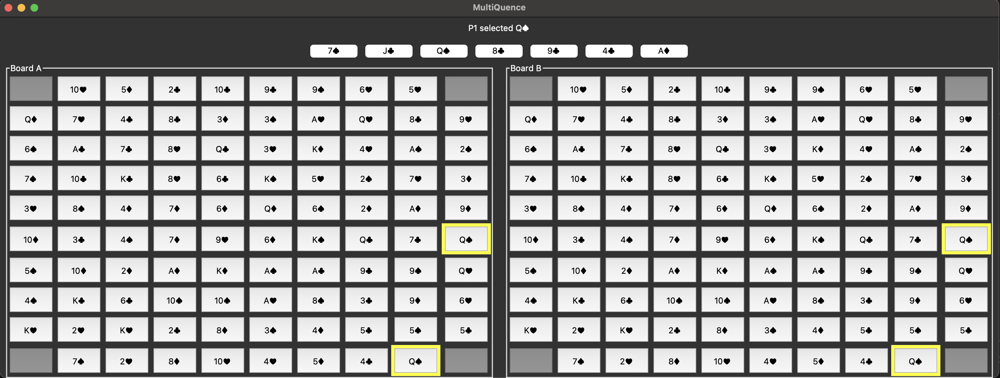
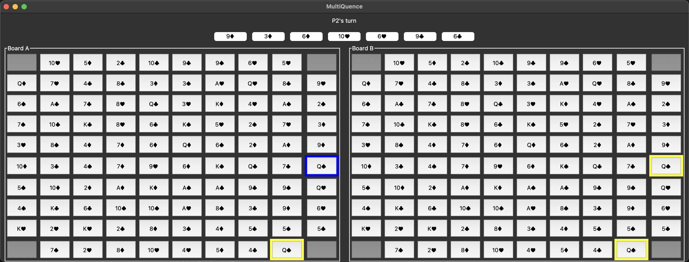
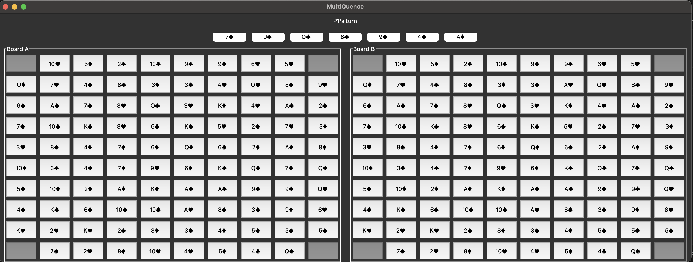

# MultiQuence 🃏🎯

**MultiQuence** is a digital spin on the classic board game *Sequence* — but with a twist. Instead of one board, you play on **two** synchronized boards. The same set of players, the same hand of cards, and the same rules — just double the strategy.

---

## 📸 Screenshots
|------------------|----------------|------------|
| Selecting a Card | Placing a Card | Board View |
|------------------|----------------|------------|
|  
|------------------|----------------|------------|
| 
|------------------|----------------|------------|
| 
|------------------|----------------|------------|

---

## 🎮 Gameplay Overview

- **Players:** 2–4
- **Cards:** Standard double deck (104 cards), Jacks included
- **Boards:** Two 10x10 boards, played simultaneously
- **Goal:** Form sequences of 5 chips in a row (horizontally, vertically, or diagonally) on **either** board

### 🃏 Card Rules

- **Normal Cards:** Play a card that matches a board cell to place your marker there.
- **Two-Eyed Jacks (♠, ♦):** Wild. Place a marker on any unoccupied space.
- **One-Eyed Jacks (♥, ♣):** Remove an opponent's marker from the board (cannot remove from corners or your own chip).

### 🎯 Special Rules

- **Corners:** Automatically occupied and treated as wild spaces.
- **Hand Size:** Each player holds 7 cards at a time.
- **Turns:** Players take turns playing a card and drawing a new one from the deck.

---

## 🛠 Setup & Running

### ✅ Requirements
- Python 3.7+
- Tkinter

### ▶️ Run the Game

```bash
python main.py
